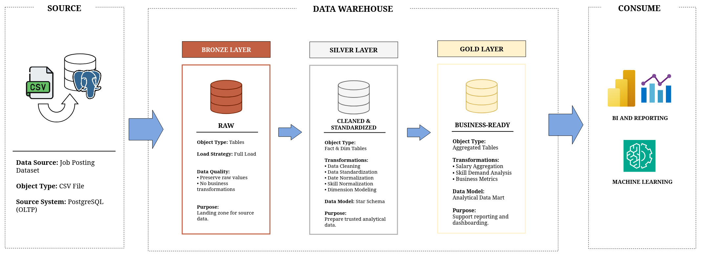

# Data Job Analytics Platform



## Overview

> _An end-to-end Data Engineering and Data Analytics project that transforms raw job posting data into a modern analytical data warehouse and provides business insights through interactive dashboards_.

The project demonstrates the complete data lifecycle, from data ingestion and warehouse development to analytical reporting and visualization.

## Objectives
- Build an end-to-end data pipeline.
- Design a dimensional data warehouse.
- Automate ETL workflows.
- Deliver analytical datasets.
- Produce business insights through dashboards.


## Sections

```text
Project

├── Data Engineering (Completed)
│   ├── Data Preparation
│   ├── Data Warehouse
│   ├── ETL Pipeline
│   ├── Airflow
│   └── Logging
│
└── Data Analytics (Soon)
    ├── Business Questions
    ├── Dashboard
    ├── Insights
    └── Recommendations
```
The project is divided into two major sections:
- Data Engineering focuses on building a reliable and scalable data platform.
- Data Analytics focuses on transforming curated data into actionable business insights. (under development.)


## Repository Structure
```text
Data-Job-Analytics-Platform/
│
├── airflow/                     # Apache Airflow configuration and orchestration
│   └── airflow_home/
│       ├── dags/                # DAG definitions for scheduling ETL workflows
│       └── logs/                # Airflow execution logs
│
├── dataset/                     # Monthly raw job posting datasets (CSV)
│   ├── jobs_month_01.csv
│   ├── jobs_month_02.csv
│   ├── jobs_month_03.csv
│   └── ...
│
├── da_analytics/                # Data analytics, dashboards, and business insights (coming soon)
│
├── de_engineering/              # Data engineering pipeline implementation
│   ├── data_preparation/        # Source data preparation and PostgreSQL ingestion
│   ├── setup_ddl/               # Database and warehouse DDL scripts
│   ├── etl_dml/                 # SQL transformations for Bronze, Silver, and Gold layers
│   └── scripts/                 # Python scripts for ETL orchestration and automation
│
├── logs/                        # Pipeline execution logs
│
├── README.md                    # Project documentation
│
└── requirements.txt             # Python project dependencies
```