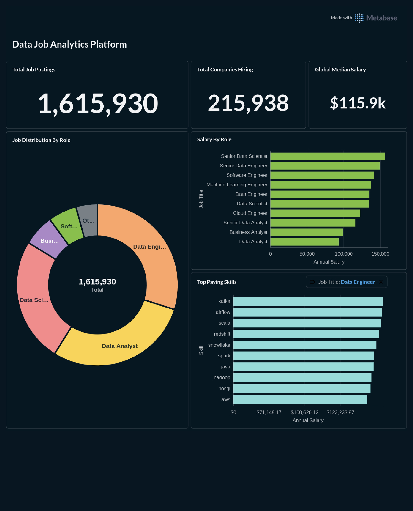

# Data Analytics & Visualization

## Overview
> _This section documents the analytical implementation of the project, covering Business Intelligence (BI) dashboarding, visual data storytelling, and deep-dive statistical analysis using Python._

> **TL;DR for Analytics Reviewers:**
> * **Direct OLAP Integration:** Connected **Metabase** directly to **ClickHouse** Gold Layer (`mart_gold`) for sub-second dashboard rendering without intermediate data caching.
> * **Deep-Dive Analytics:** Supplemented BI constraints with a **Jupyter Notebook** to execute complex statistical investigations.

**Note:** This document details the **Data Analytics** module of the [End-to-End Data Job Analytics Platform](../README.md).

## Business Objectives & Key Questions

The analytics layer is designed to translate over 1.6 million raw job postings into actionable insights for C-Level executives, HR managers, and data professionals. The analysis is structured to answer 5 core business questions:

**Level 1: Market & Compensation Trends (BI Dashboard)**
* **Q1:** What is the average salary distribution across different core data roles?
* **Q2:** What are the top-paying skills for specific roles (e.g., Data Engineer vs. Data Analyst)?

**Level 2: Deep-Dive Investigation (Python Notebook)**
* **Q3:** Which companies are the most aggressive in hiring Data Engineers and Data Analysts?
* **Q4:** Is there a statistically significant difference in compensation between Remote and On-site data roles?

## Dashboard Architecture & Design

## Dashboard Architecture & Design

The Executive Dashboard in Metabase adopts a **Single-Page, Top-Down Structure** designed for quick scanning and high-impact insights. It begins with high-level macro metrics and flows naturally into interactive, role-specific compensation analysis.



### 1. Executive Overview & KPIs
Focuses on the "Big Picture" metrics. Utilizes KPI cards to display total jobs indexed, global median salary, and total hiring companies. It also features a normalized Donut Chart demonstrating the market share dominance of the "Big 3" data roles (Data Analyst, Data Engineer, Data Scientist).

### 2. Compensation & Top Skills Analysis
An interactive, granular view focusing on financial value and skill requirements. Incorporates a global dashboard filter (e.g., `job_title_short`) allowing users to dynamically switch the visualizations between different professions. Features targeted visualizations including Average Salary comparisons by Role and Horizontal Row Charts highlighting the Top-Paying Skills for specific data professions.

## Key Technical Decisions & Analytics Highlights

To ensure data accuracy and optimal user experience (UX) within the BI environment, several advanced analytical configurations were implemented:

* **On-the-Fly Normalization:** Grouped varying levels of seniority (e.g., "Senior Data Engineer", "Lead Data Analyst") into their core roles directly within the BI presentation layer using regex and `CASE` statements to present a cleaner market share distribution.
* **Statistical Rigor via Python:** While Metabase handles macro trends seamlessly, outlier-sensitive metrics (like Remote vs. On-site compensation) are processed in Python using Boxplots and Median comparisons to avoid distortion by extreme salary values.

## Directory Structure
The **da_analytics** module contains the assets for the BI dashboards and the Jupyter Notebooks for deep-dive statistical analysis.

```text
da_analytics/
│
├── README.md                           # Analytics technical documentation
│
│
└── notebooks/                          # Deep-dive analytical scripts
    └── job_market_deep_dive.ipynb      # Python notebook answering Q4 & Q5